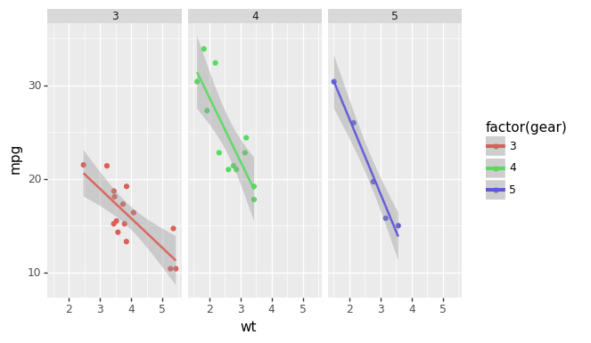

.. _index:

A Grammar of Graphics for Python
================================

plotnine is an implementation of a *grammar of graphics* in Python,
it is based on ggplot2_. The grammar allows users to compose plots
by explicitly mapping data to the visual objects that make up the
plot.

Plotting with a grammar is powerful, it makes custom (and otherwise
complex) plots easy to think about and then create, while the
simple plots remain simple.

Example
-------
.. code:: python

    from plotnine import ggplot, geom_point, aes, stat_smooth, facet_wrap
    from plotnine.data import mtcars

    (ggplot(mtcars, aes('wt', 'mpg', color='factor(gear)'))
     + geom_point()
     + stat_smooth(method='lm')
     + facet_wrap('~gear'))

Documentation
-------------

.. toctree::
   :maxdepth: 1

   api
   installation
   gallery
   changelog
   about-plotnine
   tutorials
   glossary
   external-resources

.. _ggplot2: http://ggplot2.org
